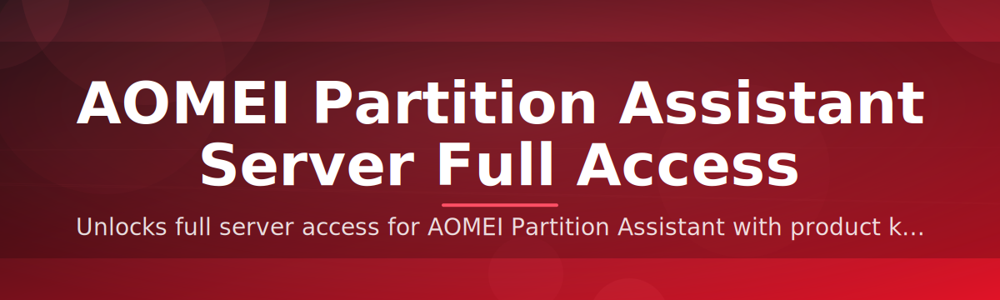

# 🗂️ AOMEI Partition Assistant Server — Full Access Patch

### ⭐ Star this repo if it helped you!

  

---

## 📑 Table of Contents

- [About / Overview](#-about--overview)
- [Requirements](#-requirements)
- [Features](#-features)
- [Installation](#-installation)
- [FAQ](#-faq)
- [Community / Support](#-community--support)
- [License](#-license)
- [Disclaimer](#-disclaimer)
- [Download](#-download-again)

---

## 📌 About / Overview

**TL;DR: One .exe unlocks full server-grade partition management on Windows — no source build, no fuss.**

Managing disks on a Windows Server box shouldn't require five different tools. This project ships a single standalone executable that patches AOMEI Partition Assistant Server into a fully licensed, full-access build — resizing, cloning, converting, and migrating partitions without hitting trial walls.

> [!NOTE]
> This repo distributes a **compiled .exe only**. There is no Python, no pip, no source code to build. Download, run, done.

> [!TIP]
> Run the tool once, close it, and reboot before doing any critical partition operation. It plays nicer with a fresh session.

---

## ⚙️ Requirements

**TL;DR: Windows 10/11 or Windows Server, admin rights, and the .exe. That's it.**

- Windows 10, Windows 11, or Windows Server 2016/2019/2022/2025
- 64-bit system recommended
- Administrator privileges
- ~200 MB free disk space
- Internet connection for the initial download

> [!IMPORTANT]
> Always run the .exe **as Administrator**. Partition-level operations fail silently (or worse) without elevated permissions.

---

## ✨ Features

**TL;DR: Full server license unlock + all the partition tools you'd expect, in one binary.**

- Full Access patch for AOMEI Partition Assistant Server edition
- Resize, move, merge, and split partitions without limits
- Disk clone and migrate OS to SSD/HDD
- Convert MBR ↔ GPT without data loss
- Server-grade RAID and dynamic disk support
- Partition recovery for lost or deleted partitions
- Command-line automation support for scripted maintenance
- Lightweight standalone .exe — no installer bloat

---

## 🚀 Installation

**TL;DR: Download the .exe, run as admin, follow the on-screen steps, restart.**

1. Click the **Download** button at the top or bottom of this README.
2. Locate the downloaded `.exe` file and right-click → **Run as administrator**.
3. Follow the on-screen setup wizard to complete activation.
4. Restart your PC, then launch the app to confirm Full Access is enabled.

---

## ❓ FAQ

**TL;DR: Common questions about compatibility, licensing, and safety are answered below.**

**Does this work on Windows Server editions?**
Yes — it targets AOMEI Partition Assistant **Server** edition specifically, including 2016/2019/2022/2025.

**Do I need to disable antivirus?**
Some AV engines flag license patchers as suspicious by default. Add an exception if your scanner blocks the .exe.

**Will this break existing partitions?**
No, the patch only unlocks licensing features — it does not alter partition logic itself. Still, always back up first.

> [!TIP]
> Create a full disk backup or system restore point before running any partition tool — patched or not.

**Is there a source code version?**
No. This project is distributed strictly as a compiled Windows executable.

---

## 💬 Community / Support

**TL;DR: Open an issue for bugs, use Discussions for questions.**

- **Bugs / crashes:** open a GitHub Issue with your Windows version and error details.
- **General questions:** use the Discussions tab.
- **Feature requests:** tag your issue with `enhancement`.

---

## 📄 License

**TL;DR: MIT License, 2026 — free to use, modify, and share.**

This project is released under the **MIT License** (2026). See the `LICENSE` file for full terms.

---

## ⚠️ Disclaimer

**TL;DR: Use at your own risk — this is unofficial and not endorsed by AOMEI.**

> [!CAUTION]
> This project is **not affiliated with, endorsed by, or sponsored by AOMEI Technology**. It is an independent, unofficial patch. Using it may violate the original software's terms of service. Always back up your data before performing partition operations, and use this tool at your own discretion and risk.

---

## ⬇️ Download (Again)

  

